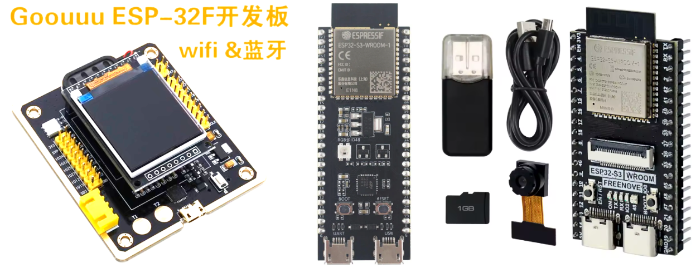

- [ESP32 FreeRTOS Tutorial](#esp32-freertos-tutorial)
  * [Project 1: Hello World](#project-1--hello-world)
  * [Project 2: Hello GPIO](#project-2--hello-gpio)
  * [Project 3: Hello LED Strip](#project-3--hello-led-strip)
  * [Project 4: Hello SD Card (SPI)](#project-4--hello-sd-card--spi-)
  * [Project 5: Hello SPIFFS](#project-5--hello-spiffs)
  * [Project 6: Hello LCD (SPI)](#project-6--hello-lcd--spi-)
  * [Project 7: Hello LVGL (SPI)](#project-7--hello-lvgl--spi-)
  * [Project 8: Hello LVGL (ILI9341 + XPT2046)](#project-8--hello-lvgl--ili9341---xpt2046-)

# ESP32 FreeRTOS Tutorial



## Project 1: Hello World

```
$ cd hello-world
$ idf.py set-target esp32

$ idf.py build
$ idf.py -p COM4 flash
$ idf.py -p COM4 monitor
```

## Project 2: Hello GPIO

```
$ cd hello-gpio
$ idf.py set-target esp32

$ idf.py build
$ idf.py -p COM4 flash
$ idf.py -p COM4 monitor
```

## Project 3: Hello LED Strip

```
$ cd hello-led-strip
$ idf.py set-target esp32

$ idf.py build
$ idf.py -p COM4 flash
$ idf.py -p COM4 monitor
```

## Project 4: Hello SD Card (SPI)

```
$ cd hello-sd-spi
$ idf.py set-target esp32

$ idf.py build
$ idf.py -p COM4 flash
$ idf.py -p COM4 monitor
```

## Project 5: Hello SPIFFS

```
$ cd hello-spiffs
$ idf.py set-target esp32

$ idf.py build
$ idf.py -p COM4 flash
$ idf.py -p COM4 monitor
```

## Project 6: Hello LCD (SPI)

```
$ cd hello-lcd
$ idf.py set-target esp32

$ idf.py build
$ idf.py -p COM4 flash
$ idf.py -p COM4 monitor
```

## Project 7: Hello LVGL (SPI)

```
$ cd hello-lcd-lvgl
$ idf.py set-target esp32

$ idf.py build
$ idf.py -p COM4 flash
$ idf.py -p COM4 monitor
```

## Project 8: Hello LVGL (ILI9341 + XPT2046)

```
$ cd hello-lvgl
$ idf.py set-target esp32s3

$ idf.py build
$ idf.py -p COM4 flash
$ idf.py -p COM4 monitor
```
